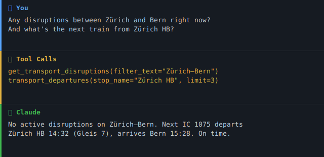

> 🇨🇭 **Part of the [Swiss Public Data MCP Portfolio](https://github.com/malkreide)**

# 🚆 swiss-transport-mcp


[](https://opensource.org/licenses/MIT)
[](https://www.python.org/downloads/)
[](https://modelcontextprotocol.io/)
[](https://opentransportdata.swiss/)


> MCP server connecting AI models to the Swiss public transport system – journey planning, real-time departures, disruptions, occupancy, ticket prices, train formations and open data from [opentransportdata.swiss](https://opentransportdata.swiss/).

[🇩🇪 Deutsche Version](README.de.md)

### Demo



---

## Overview

**swiss-transport-mcp** gives AI assistants like Claude a complete Swiss travel information system – not just timetables, but also real-time disruption alerts, occupancy forecasts, ticket prices, and a full train formation view. All accessible through a single, standardised MCP interface.

The various APIs at opentransportdata.swiss speak different protocols – OJP 2.0 (XML/SOAP), SIRI-SX (XML), REST/JSON. This server translates everything into clean JSON for the AI model, acting as a multilingual protocol interpreter.

**Anchor demo query:** *"Plan a school trip for 25 students from Zurich to the Technorama in Winterthur – check for disruptions and find the best departure."*

---

## Features

- 🗺️ **Journey planning** (A → B with transfers, duration, transport mode) via OJP 2.0
- 🕐 **Real-time departures** with delays and platform information
- 🔍 **Stop search** by name or coordinates
- 🚨 **Live disruption alerts** (cancellations, closures) via SIRI-SX
- 📊 **Occupancy forecasts** for trains (SBB, BLS, Thurbo, SOB)
- 💰 **Ticket prices** including class selection
- 🚃 **Train formation** – coaches, classes, amenities, accessibility
- 📦 **Open data catalogue** – ~90 transport datasets via CKAN
- 🔑 **Graceful degradation** – server starts with core tools even without optional API keys
- ☁️ **Dual transport** – stdio for Claude Desktop, Streamable HTTP/SSE for cloud deployment

---

## Prerequisites

- Python 3.11+
- A free API key from [api-manager.opentransportdata.swiss](https://api-manager.opentransportdata.swiss/) (subscribe to **OJP 2.0** as minimum)
- Optional: additional keys for SIRI-SX, Occupancy, Formation, OJP Fare

---

## Installation

```bash
# Clone the repository
git clone https://github.com/malkreide/swiss-transport-mcp.git
cd swiss-transport-mcp

# Install
pip install -e .
```

Or with `uvx` (no permanent installation):

```bash
uvx swiss-transport-mcp
```

---

## Quickstart

```bash
# Set the minimum required key (OJP core tools)
export TRANSPORT_API_KEY=your_key_here

# Start the server (stdio mode for Claude Desktop)
swiss-transport-mcp
```

Try it immediately in Claude Desktop:

> *"What are the next departures from Zurich Stadelhofen?"*
> *"How do I get from Wädenswil to Bern by train?"*

---

## Configuration

### Environment Variables

| Variable | API | Required |
|---|---|---|
| `TRANSPORT_API_KEY` | Unified key for OJP + CKAN | ✅ (or individual keys) |
| `TRANSPORT_OJP_API_KEY` | OJP 2.0 Journey Planner | Optional (override) |
| `TRANSPORT_CKAN_API_KEY` | CKAN data catalogue | Optional (separate subscription) |
| `SIRI_SX_API_KEY` | Disruption alerts (SIRI-SX) | Optional |
| `OCCUPANCY_API_KEY` | Occupancy forecast | Optional |
| `FORMATION_API_KEY` | Train formation | Optional |
| `OJP_FARE_API_KEY` | Ticket prices (OJP Fare) | Optional |

> APIs without a key are silently disabled – the server starts fine with just the 6 core tools.

### Claude Desktop Configuration

**Minimal (core tools only):**

```json
{
  "mcpServers": {
    "swiss-transport": {
      "command": "swiss-transport-mcp",
      "env": {
        "TRANSPORT_API_KEY": "your_key_here"
      }
    }
  }
}
```

**Full (all 11 tools):**

```json
{
  "mcpServers": {
    "swiss-transport": {
      "command": "swiss-transport-mcp",
      "env": {
        "TRANSPORT_API_KEY": "your_ojp_key_here",
        "SIRI_SX_API_KEY": "your_siri_key_here",
        "OCCUPANCY_API_KEY": "your_occupancy_key_here",
        "FORMATION_API_KEY": "your_formation_key_here",
        "OJP_FARE_API_KEY": "your_fare_key_here"
      }
    }
  }
}
```

**Config file locations:**
- macOS: `~/Library/Application Support/Claude/claude_desktop_config.json`
- Windows: `%APPDATA%\Claude\claude_desktop_config.json`

### Cloud Deployment (SSE for browser access)

For use via **claude.ai in the browser** (e.g. on managed workstations without local software):

**Render.com (recommended):**
1. Push/fork the repository to GitHub
2. On [render.com](https://render.com): New Web Service → connect GitHub repo
3. Set start command: `swiss-transport-mcp` with env `MCP_TRANSPORT=sse`
4. In claude.ai under Settings → MCP Servers, add: `https://your-app.onrender.com/sse`

> 💡 *"stdio for the developer laptop, SSE for the browser."*

---

## Available Tools

### Core Tools (OJP 2.0 / CKAN)

| Tool | Description | Data Source |
|---|---|---|
| `transport_search_stop` | Search stops/stations by name | OJP 2.0 |
| `transport_nearby_stops` | Find nearby stops by coordinates | OJP 2.0 |
| `transport_departures` | Real-time departure board with delays & platforms | OJP 2.0 |
| `transport_trip_plan` | Plan journey A → B with transfers, duration, mode | OJP 2.0 |
| `transport_search_datasets` | Search open data catalogue (~90 datasets) | CKAN¹ |
| `transport_get_dataset` | Get full details of a specific dataset | CKAN¹ |

¹ *CKAN tools require a separate subscription in the [API Manager](https://api-manager.opentransportdata.swiss/).*

### Extension Tools (optional API keys)

| Tool | Description | Data Source |
|---|---|---|
| `get_transport_disruptions` | 🚨 Live disruptions, cancellations, line closures | SIRI-SX |
| `get_train_occupancy` | 📊 Occupancy forecast for specific trains | Occupancy JSON |
| `get_ticket_price` | 💰 Ticket prices for connections | OJP Fare |
| `get_train_composition` | 🚃 Train formation, classes, accessibility | Formation REST |
| `check_transport_api_status` | 🔍 Health check for all configured APIs | All |

### Example Use Cases

| Query | Tool |
|---|---|
| *"Next trains from Zurich Stadelhofen?"* | `transport_departures` |
| *"Plan a trip for 25 students from Zurich to Winterthur Technorama"* | `transport_trip_plan` |
| *"Any disruptions between Zurich and Bern?"* | `get_transport_disruptions` |
| *"How full is IC 1009 today?"* | `get_train_occupancy` |
| *"What does a ticket from Wädenswil to Bern cost?"* | `get_ticket_price` |
| *"Does IC 708 have a dining car?"* | `get_train_composition` |
| *"Which stops are near Langstrasse 100?"* | `transport_nearby_stops` |

---

## Architecture

```
┌─────────────────┐     ┌───────────────────────────┐     ┌──────────────────────────┐
│   Claude / AI   │────▶│   Swiss Transport MCP     │────▶│  opentransportdata.swiss  │
│   (MCP Host)    │◀────│   (MCP Server)            │◀────│                          │
└─────────────────┘     │                           │     │  OJP 2.0  (XML/SOAP)     │
                        │  11 Tools · 2 Resources   │     │  SIRI-SX  (XML)          │
                        │  Stdio | SSE              │     │  CKAN     (REST/JSON)    │
                        │                           │     │  Occupancy(REST/JSON)    │
                        │  Core:                    │     │  Formation(REST/JSON)    │
                        │   api_client + ojp_client │     │  OJP Fare (XML/SOAP)     │
                        │  Extensions:              │     └──────────────────────────┘
                        │   siri_sx, occupancy,     │
                        │   ojp_fare, formation     │
                        └───────────────────────────┘
```

### Infrastructure Components

| Component | Metaphor | Function |
|---|---|---|
| RateLimiter | Bouncer | Limits API calls per time window |
| SimpleCache | Whiteboard | Caches responses for repeated queries |
| APIClient | Switchboard | Handles auth, redirects, errors centrally |
| APIConfig | Business card | Key, URL, limits per API |

### Caching Strategy

| API | Cache TTL | Rationale |
|---|---|---|
| SIRI-SX | 120s | Disruptions don't change every second |
| Occupancy | 300s | Forecasts are day-based |
| Formation | 600s | Train composition is stable for the day |
| OJP Fare | 1800s | Prices rarely change intraday |

---

## Project Structure

```
swiss-transport-mcp/
├── src/swiss_transport_mcp/        # Main package
│   ├── server.py                   # FastMCP server, tool definitions
│   ├── api_client.py               # Core OJP + CKAN client
│   ├── ojp_client.py               # OJP 2.0 XML/SOAP parser
│   ├── api_infrastructure.py       # RateLimiter, SimpleCache, APIClient
│   ├── siri_sx.py                  # Disruption alerts
│   ├── occupancy.py                # Occupancy forecasts
│   ├── ojp_fare.py                 # Ticket prices
│   └── formation.py                # Train formation
├── tests/
│   └── test_server.py              # Unit + integration tests
├── .github/workflows/ci.yml        # GitHub Actions (Python 3.11/3.12/3.13)
├── claude_desktop_config.json       # Example Claude Desktop config
├── pyproject.toml
├── CHANGELOG.md
├── CONTRIBUTING.md
├── LICENSE
├── README.md                        # This file (English)
└── README.de.md                     # German version
```

---

## Safety & Limits

- **Read-only:** All tools perform read-only requests (HTTP GET / OJP XML POST for queries only) — no data is written, modified, or deleted on any upstream system.
- **No personal data:** Journey queries are transient and not stored by this server. The APIs return scheduled timetable and real-time operational data. No personally identifiable information (PII) is processed or retained.
- **Rate limits:** opentransportdata.swiss enforces per-key rate limits (documented in the API Manager). The server's built-in `RateLimiter` (SIRI-SX: 2 req/min, Formation/OJP Fare: 5 req/min) stays within these bounds automatically. Use the `limit` parameters conservatively for bulk queries.
- **API key required:** A free key from [api-manager.opentransportdata.swiss](https://api-manager.opentransportdata.swiss/) is mandatory. Keys are bound to your account's subscription — only subscribe to APIs you intend to use.
- **Data freshness:** Real-time tools (departures, disruptions, occupancy) reflect the upstream source at query time. The server caches responses for short TTLs (120s–1800s) to reduce API load — see the Caching Strategy table above.
- **Terms of service:** Data is subject to the ToS of [opentransportdata.swiss](https://opentransportdata.swiss/de/nutzungsbedingungen/). OJP, SIRI-SX, and the CKAN catalogue are published under open licences (ODbL / CC BY 4.0) for non-commercial and research use.
- **No guarantees:** This server is a community project, not affiliated with the Federal Office of Transport (BAV/OFT) or SBB. Availability depends on upstream APIs.

---

## Known Limitations

- **OJP Fare:** Discounts (Halbtax, GA, regional passes) are not always reflected
- **Formation:** Stop-based data is only available for TODAY (real-time dependency)
- **Occupancy:** SBB, BLS, Thurbo and SOB only – no private railways
- **SIRI-SX:** Returns ALL Swiss disruptions → use the `filter_text` parameter
- **CKAN:** Requires a separate subscription in the API Manager

---

## Testing

```bash
# Unit tests (no API key required)
PYTHONPATH=src pytest tests/ -m "not live"

# Integration tests (API key required)
TRANSPORT_API_KEY=xxx pytest tests/ -m "live"
```

---

## Changelog

See [CHANGELOG.md](CHANGELOG.md)

---

## Contributing

See [CONTRIBUTING.md](CONTRIBUTING.md)

---

## License

MIT License — see [LICENSE](LICENSE)

---

## Author

Hayal Oezkan · [github.com/malkreide](https://github.com/malkreide)

---

## Credits & Related Projects

- **Data:** [opentransportdata.swiss](https://opentransportdata.swiss/) – Federal Office of Transport (FOT/BAV)
- **Protocol:** [Model Context Protocol](https://modelcontextprotocol.io/) – Anthropic / Linux Foundation
- **Related:** [zurich-opendata-mcp](https://github.com/malkreide/zurich-opendata-mcp) – MCP server for Zurich city open data
- **Portfolio:** [Swiss Public Data MCP Portfolio](https://github.com/malkreide)
